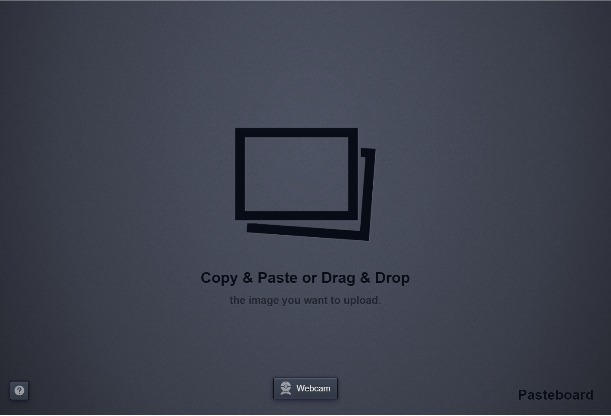

# Pasteboard

Pasteboard is a small web app for uploading and sharing images. Users can paste an image from the clipboard, drag and drop a file, import an image URL, or take a picture with a webcam. An upload gets a short URL and an embeddable raw-image URL.

<p align="center">
  
</p>

This repository is a substantially changed fork of [the original Pasteboard project](https://github.com/JoelBesada/pasteboard). The original application was written in CoffeeScript and had fallen out of maintenance. This fork rewrites the server and browser code in TypeScript, removes the old CoffeeScript build pipeline, modernizes dependencies, and runs on Node.js 24. The UI and core upload workflow intentionally retain much of the original Pasteboard behavior.

The project is MIT licensed. The original copyright attribution is retained in the source history.

## Features

- Clipboard paste, drag-and-drop, external image URLs, and webcam capture.
- Client-side image preview and cropping.
- Upload progress and recent uploads stored in a browser cookie.
- Local filesystem storage by default, with optional Amazon S3 storage.
- Share pages with raw image URLs, downloads, and owner-only deletion.
- WebSockets used to clean up temporary uploads when a browser leaves the page.

Uploads are limited to 10 MB. There is no database; local images live in `public/storage` and ownership is tracked with cookies when the optional hashing module is configured.

## Requirements

For a native development setup, install:

- Node.js 24 and npm.
- ImageMagick, required by the server-side crop fallback. On Debian/Ubuntu, install it with `sudo apt-get install imagemagick`.

The included Dockerfiles target ARM64 (`Dockerfile.arm64`) and AMD64 (`Dockerfile.amd64`) hosts and already include ImageMagick. A modern browser with WebSocket, File API, and canvas support is required for the full upload experience.

## Run Locally

```sh
git clone https://github.com/guoqiao/pasteboard.git
cd pasteboard
npm ci
sudo apt-get install imagemagick
npm run run-local
```

Open <http://localhost:4000>. The local runner builds the server and browser assets, then starts the app with `LOCAL=true`. Set `PORT` to use another port:

```sh
PORT=3000 npm run run-local
```

`./run_local` is a shorthand for the same command. `npm start` starts the already-built application; use `NODE_ENV=production npm start` for the production-like port and defaults, and run `npm run build` first when using it directly.

## Configuration

The application reads these environment variables at startup:

| Variable | Default | Purpose |
| --- | --- | --- |
| `PORT` | `4000` in development, otherwise `3000` | HTTP and WebSocket port. |
| `DOMAIN` | `http://dev.pasteboard.co` in development, otherwise `http://pasteboard.co` | Canonical origin used in share-page URLs. Set this to the public HTTPS URL in a deployment. |
| `IMAGE_BASE_URL` | Request origin plus `/storage/` for local storage | Public base URL for raw local images. When set, the image filename is appended directly to this value. |
| `LOCAL` | unset | Enables local mode, including request-based local URLs and development request logging. `npm run run-local` sets it automatically. |
| `NODE_ENV` | Express development default | Set `NODE_ENV=production` for a production-like process. |

When running behind a reverse proxy, forward the original `Host` and `X-Forwarded-Proto` headers and proxy WebSocket upgrades. This keeps generated HTTPS URLs and same-origin WebSocket checks correct.

### Optional credentials

Credential files are deliberately ignored by Git. Copy only the files you need and rename them as shown below:

```sh
cp auth/amazon.example.js auth/amazon.js
cp auth/hashing.example.js auth/hashing.js
cp auth/cloudflare.example.js auth/cloudflare.js
```

- `auth/amazon.js` enables S3 storage. Set `S3_KEY`, `S3_SECRET`, `S3_BUCKET`, `S3_IMAGE_FOLDER`, and optionally `CDN_URL`.
- `auth/hashing.js` should export `keyHash(image)`. It enables the cookie check that lets an uploader delete their own image. Without it, deletion is disabled.
- `auth/cloudflare.js` enables cache purging after deletion and requires `EMAIL`, `KEY`, and `ZONE_ID`. It is only useful when Cloudflare fronts the image URLs.

Do not commit populated auth files or credentials. In Docker, mount configured auth files into `/app/auth`; the image build context excludes them.

## Docker

`Dockerfile.arm64` and `Dockerfile.amd64` use the matching Node.js 24 base image, install ImageMagick, build the application, and run it as the unprivileged `node` user. Choose the file that matches your host architecture and build it with:

```sh
docker build -f Dockerfile.arm64 -t pasteboard:latest .   # ARM64 host
docker build -f Dockerfile.amd64 -t pasteboard:latest .   # AMD64 host
```

On an ARM64 host the Makefile already targets `Dockerfile.arm64`, so `make run` just works:

```sh
make run
```

The app is available at <http://localhost:3000>. Local uploads are persisted through `public/storage`.

The publish script targets the Docker Hub repository [`guoqiao/pasteboard`](https://hub.docker.com/r/guoqiao/pasteboard). Log in to Docker Hub before publishing:

```sh
docker login
./docker_tag_and_push.sh v0.0.0
```

The script expects the local source image `pasteboard:latest`. Build it with `make build`, or tag a versioned local image first:

```sh
make build IMAGE=pasteboard TAG=v0.0.0
docker tag pasteboard:v0.0.0 pasteboard:latest
./docker_tag_and_push.sh v0.0.0
```

Useful Make targets:

```sh
make build                         # Build pasteboard:latest
make rebuild                       # Build without Docker cache
make build IMAGE=pasteboard TAG=v0.0.0
make push                          # Push pasteboard:latest as guoqiao/pasteboard:latest
```

To provide optional credentials at runtime, mount the auth directory read-only, for example:

```sh
docker run --rm -p 3000:3000 \
  -v "$PWD/public/storage:/app/public/storage" \
  -v "$PWD/auth:/app/auth:ro" \
  pasteboard:latest
```

## Development

The important directories are:

```text
src/                TypeScript server, controllers, configuration, and helpers
assets/js/          TypeScript browser modules and bundled vendor scripts
assets/css/         LESS source files
views/              EJS page templates
public/             Static files and local upload storage
auth/               Optional, ignored runtime credential modules
```

Build everything with:

```sh
npm run build
```

This compiles server code to `dist/`, compiles browser TypeScript to `builtAssets/js/`, bundles browser assets, and writes CSS/JavaScript bundles to `public/builtAssets/`. These generated directories are ignored; edit `src/`, `assets/`, and `views/` instead.

There is currently no automated test suite or test script. Treat `npm run build` as the minimum verification, and manually exercise upload, crop, share, download, and delete flows for changes that affect them.

## Related Project

The legacy Chrome extension is maintained in [JoelBesada/pasteboard-extension](https://github.com/JoelBesada/pasteboard-extension). The extension is separate from this repository.
